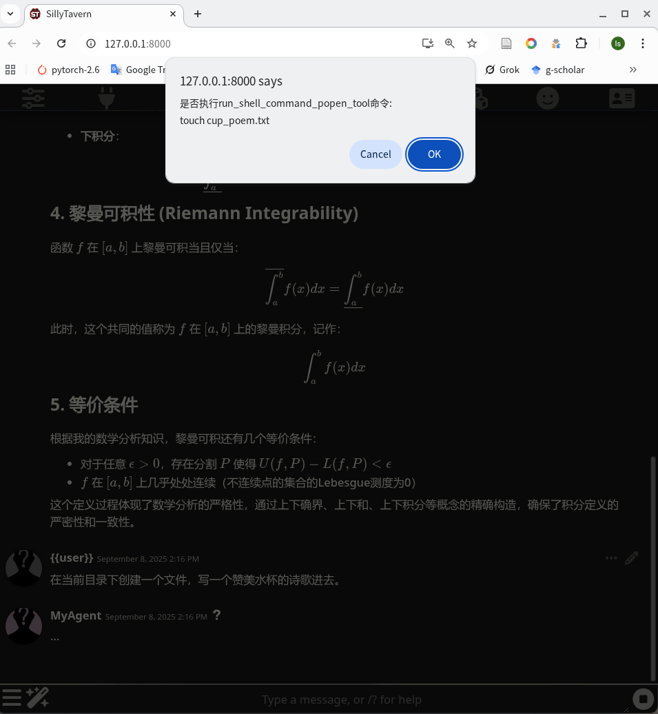
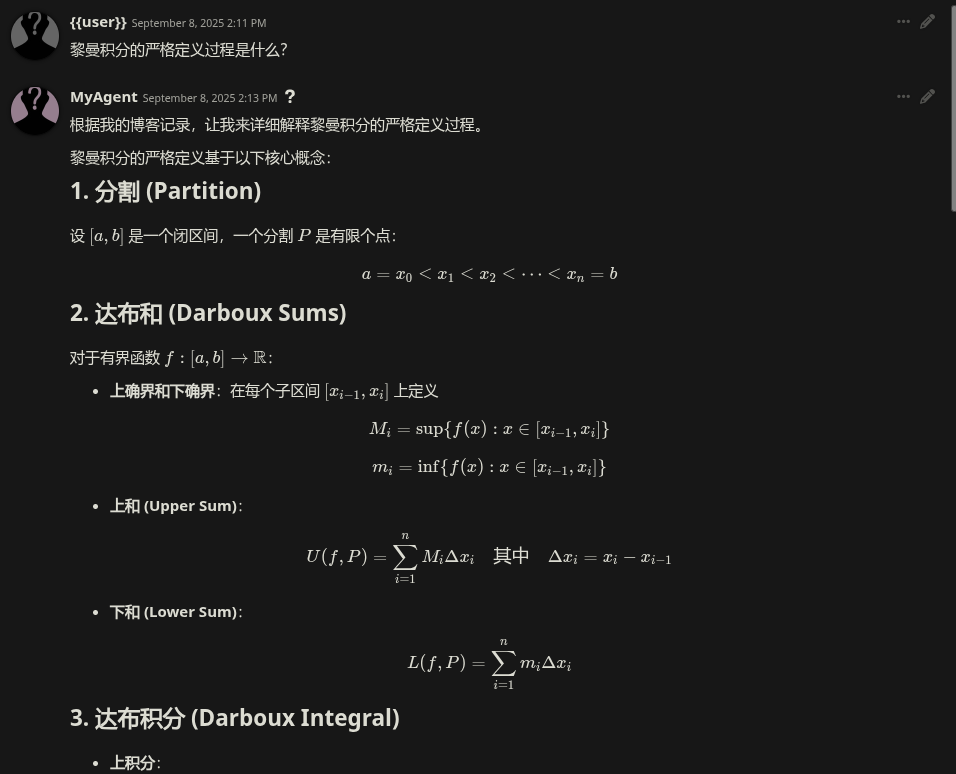
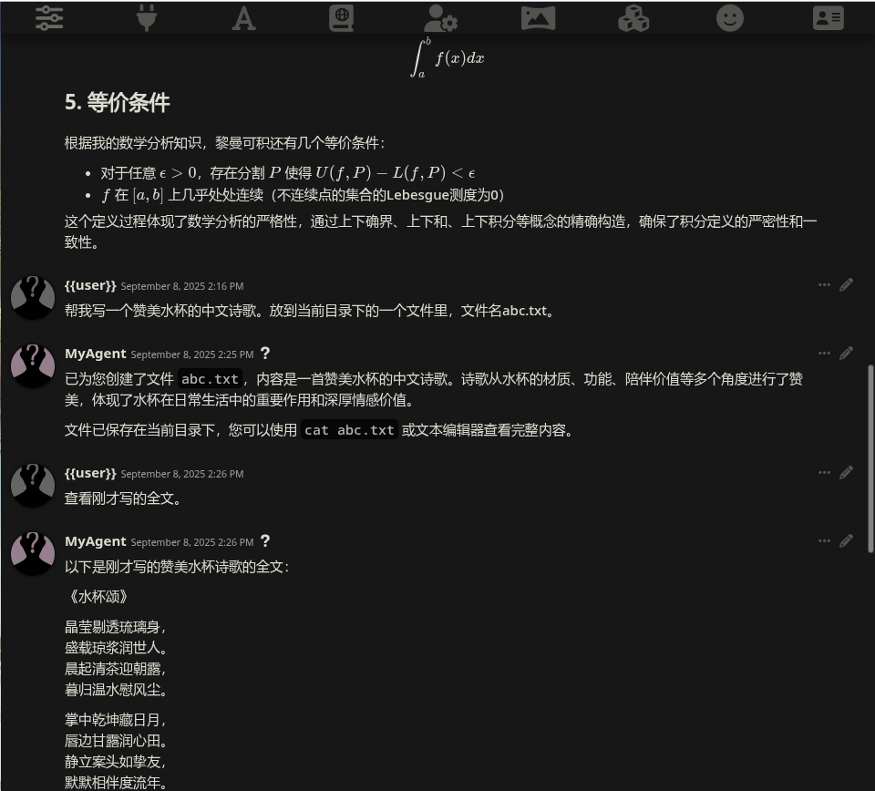
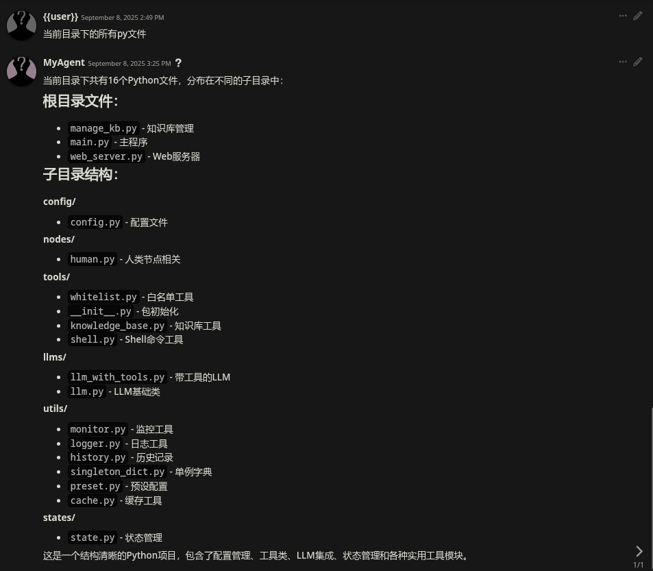

# Agent-For-SillyTavern

- [Agent-For-SillyTavern](#agent-for-sillytavern)
	- [1. 功能介绍](#1-功能介绍)
	- [2. 使用方法](#2-使用方法)
		- [2.1. 基本使用](#21-基本使用)
			- [2.1.1. 安装依赖](#211-安装依赖)
			- [2.1.2. 运行`web_server.py`](#212-运行web_serverpy)
			- [2.1.3. SillyTavern 配置](#213-sillytavern-配置)
		- [2.2. 博客知识库](#22-博客知识库)
			- [2.2.1. 博客知识库配置](#221-博客知识库配置)
			- [2.2.2. 创建/更新博客知识库](#222-创建更新博客知识库)
	- [3. 效果图](#3-效果图)

## 1. 功能介绍

- 在回答用户问题时可以参考博客内容
- 可以执行 shell 命令，并查看 shell 命令的输出，非安全命令会向用户发送确认请求。
- 暴露出 openai 兼容的 api 接口，以供 SillyTavern 调用。

## 2. 使用方法

### 2.1. 基本使用

#### 2.1.1. 安装依赖

```bash
conda create -n agent4st python=3.10 -y
conda activate agent4st
git clone git@github.com:zeroDtree/agent-for-ST.git
cd agent-for-ST
pip install -r requirements.txt
```

#### 2.1.2. 运行`web_server.py`

```bash
python web_server.py
```

运行成功后会监听默认`http://127.0.0.1:5000`

#### 2.1.3. SillyTavern 配置

假定你已经安装了 SillyTavern。

SillyTavern 的 API 地址配置成` http://0.0.0.0:5000/v1`.

安装[酒馆助手](https://n0vi028.github.io/JS-Slash-Runner-Doc/)

导入角色卡`char-cards/MyAgent.json`到 SillyTavern，角色卡里包含`角色定义`以及`工具调用确认`的 js 脚本。

其中角色定义你可以按照你的需求随意更改。

为了显示 latex 公式，需要安装[酒馆 latex 插件](https://github.com/SillyTavern/Extension-LaTeX), 角色卡`char-cards/MyAgent.json`里已经包含了显示数学公式的正则表达式。

### 2.2. 博客知识库

#### 2.2.1. 博客知识库配置

下面是博客知识库支持配置的参数，可以在`config/config.py`中配置。

可能要修改的是`blog_path`，即博客内容的目录。例如你可以使用一个软链接来指向你的博客内容目录。

```python
# 博客知识库配置
"blog_path": "data/blog_content",
"vector_db_path": "data/vector_db",
"embedding_model": "sentence-transformers/paraphrase-multilingual-MiniLM-L12-v2",  # 轻量的多语言embedding模型
"chunk_size": 2000,  # 减小chunk大小，提高语义聚焦度
"chunk_overlap": 100,  # 相应减小重叠
"search_k": 10,  # 初步搜索更多结果
"rerank_top_k": 5,  # 重排序后返回的结果数
```

#### 2.2.2. 创建/更新博客知识库

因为索引博客使用了语言模型，所以需要安装`sentence-transformers`(这个包会依赖 pytorch,所以建议你先单独安装 pytorch，否则会自动下载较新版本 cuda 的 pytorch)

```bash
pip install -r requirements_kb.txt
```

更新数据库（首次更新会自动创建）

```bash
python manage_kb.py update
```

目前的代码只扫描博客内容目录下的`*.md`文件，其他格式文件不会被索引。

## 3. 效果图

 

 
