## Command Check Flow

```mermaid
flowchart TD
    A[🤖 AI Initiates Tool Call] --> B{Tool Type Classification}

    B -->|Knowledge Base Tools| C[🟢 Safe Tools<br/>Direct Execution]
    B -->|Shell Command Tools| D[Shell Command Validation Flow]
    B -->|Confirm Required Tools| E[⚠️ Requires User Confirmation]
    B -->|Unknown Tools| F[⚠️ Unknown Tools<br/>Requires Confirmation]

    D --> G{Check Execution Mode}

    G -->|Restricted Mode| H[Restricted Mode Validation]
    G -->|Normal Mode| I[Normal Mode Validation]

    H --> J[is_safe_command_with_restrictions]
    I --> K[cached_is_safe_command<br/>LRU Cache Check]

    J --> L[Basic Safety Check<br/>is_safe_command]
    K --> L

    L --> M[Extract First Word of Command]
    M --> N{Check Blacklist<br/>DANGEROUS_COMMANDS}
    N -->|In Blacklist| O[❌ Dangerous Command Blocked]
    N -->|Not in Blacklist| P{Check Whitelist<br/>SAFE_COMMANDS}

    P -->|Not in Whitelist| O
    P -->|In Whitelist| Q{Restricted Mode?}

    Q -->|No| R[✅ Basic Safety Passed]
    Q -->|Yes| S[Path Validation<br/>validate_command_paths]

    S --> T[Extract Command Paths<br/>extract_paths_from_command]
    T --> U[Regex Match File Paths]
    U --> V{Check Each Path<br/>is_path_allowed}

    V --> W[Path Normalization<br/>normalize_path]
    W --> X{Path Location Check}

    X -->|Inside Allowed Directory| Y[✅ Path Validation Passed]
    X -->|Parent Directory & Read Allowed| Y
    X -->|Other Locations| Z[❌ Path Blocked]

    R --> AA[🟢 Route to my_tools]
    Y --> AA
    Z --> BB[🚫 Route to human_confirm]
    O --> BB

    AA --> CC[run_shell_command_popen_tool]

    CC --> DD{Check Restricted Mode Again}
    DD -->|Restricted Mode| EE[Secondary Path Validation<br/>validate_command_paths]
    DD -->|Normal Mode| FF[Get Working Directory<br/>working_directory]

    EE --> GG{Path Validation Result}
    GG -->|Passed| HH[Get Safe Working Directory<br/>get_safe_working_directory]
    GG -->|Failed| II[🚫 Return Error Message]

    HH --> JJ[subprocess.run<br/>cwd=safe_directory]
    FF --> KK[subprocess.run<br/>cwd=working_directory]

    JJ --> LL[📊 Log Execution<br/>log_command_execution]
    KK --> LL
    II --> MM[📊 Log Block Event]

    LL --> NN[🔄 Return Command Result to User]
    MM --> NN

    C --> NN
    E --> OO[👤 Wait for User Confirmation]
    F --> OO
    BB --> OO

    OO --> PP{User Choice}
    PP -->|Confirm| AA
    PP -->|Reject| QQ[❌ User Rejected Execution]

    QQ --> NN

    style A fill:#e1f5fe
    style C fill:#c8e6c9
    style AA fill:#c8e6c9
    style O fill:#ffcdd2
    style Z fill:#ffcdd2
    style II fill:#ffcdd2
    style QQ fill:#ffcdd2
    style OO fill:#fff3e0
    style NN fill:#f3e5f5

    classDef processBox fill:#e8f5e8,stroke:#4caf50,stroke-width:2px
    classDef decisionBox fill:#fff3e0,stroke:#ff9800,stroke-width:2px
    classDef errorBox fill:#ffebee,stroke:#f44336,stroke-width:2px
    classDef successBox fill:#e8f5e8,stroke:#4caf50,stroke-width:2px

    class L,J,K,T,U,W,EE,HH,JJ,KK processBox
    class B,G,N,P,Q,V,X,DD,GG,PP decisionBox
    class O,Z,II,QQ errorBox
    class C,AA,Y,R successBox
```

## Key Validation Node Descriptions

### 🔍 Tool Classification Stage

- **Safe Tools**: Knowledge base related tools, direct execution
- **Shell Tools**: Require complex security validation
- **Confirmation Tools**: Explicitly require user confirmation
- **Unknown Tools**: Default to requiring confirmation

### 🛡️ Shell Command Validation Stage

#### First Layer: Basic Safety Check

1. **Blacklist Check**: Block explicitly dangerous commands
2. **Whitelist Check**: Only allow predefined safe commands

#### Second Layer: Restricted Mode Check (Optional)

1. **Path Extraction**: Use regex to extract file paths from commands
2. **Path Validation**: Check if paths are within allowed directory scope
3. **Permission Check**: Distinguish read/write operations, apply different restriction rules

#### Third Layer: Execution Stage Validation

1. **Secondary Validation**: Check again before actual execution
2. **Working Directory Restriction**: Use `subprocess.cwd` to limit command execution scope
3. **Logging**: Complete logging of all operations for auditing

### 📊 Cache Optimization

- **LRU Cache**: Cache safety check results for frequently used commands
- **Performance Monitoring**: Record check timing, optimize bottlenecks

This flow ensures multi-layered protection, guaranteeing both security and system usability.

### Working Directory Flow

