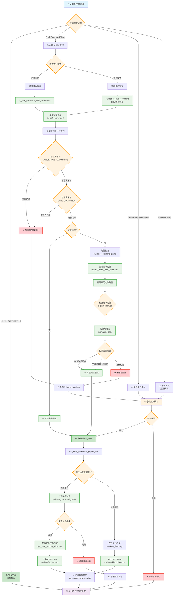
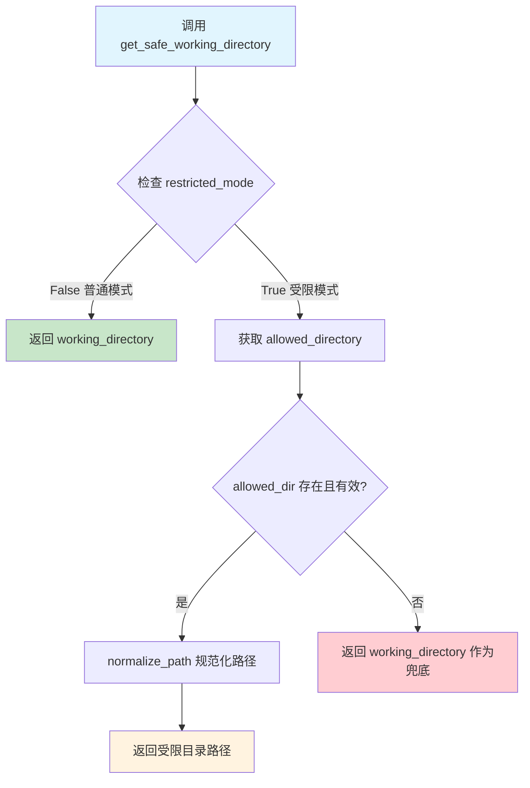

## 命令检查流程

## 关键验证节点说明

### 🔍 工具分类阶段

- **安全工具**: 知识库相关工具，直接执行
- **Shell 工具**: 需要经过复杂的安全验证
- **确认工具**: 明确需要用户确认的工具
- **未知工具**: 默认需要确认

### 🛡️ Shell 命令验证阶段

#### 第一层：基础安全检查

1. **黑名单检查**: 阻止明确危险的命令
2. **白名单检查**: 只允许预定义的安全命令

#### 第二层：受限模式检查（可选）

1. **路径提取**: 使用正则表达式提取命令中的文件路径
2. **路径验证**: 检查路径是否在允许的目录范围内
3. **权限检查**: 区分读写操作，应用不同的限制规则

#### 第三层：执行阶段验证

1. **二次验证**: 在实际执行前再次检查
2. **工作目录限制**: 使用 `subprocess.cwd` 限制命令执行范围
3. **日志记录**: 完整记录所有操作用于审计

### 📊 缓存优化

- **LRU 缓存**: 对常用命令的安全检查结果进行缓存
- **性能监控**: 记录检查耗时，优化瓶颈点

这个流程确保了多层防护，既保证了安全性，又维持了系统的可用性。

### workdir

